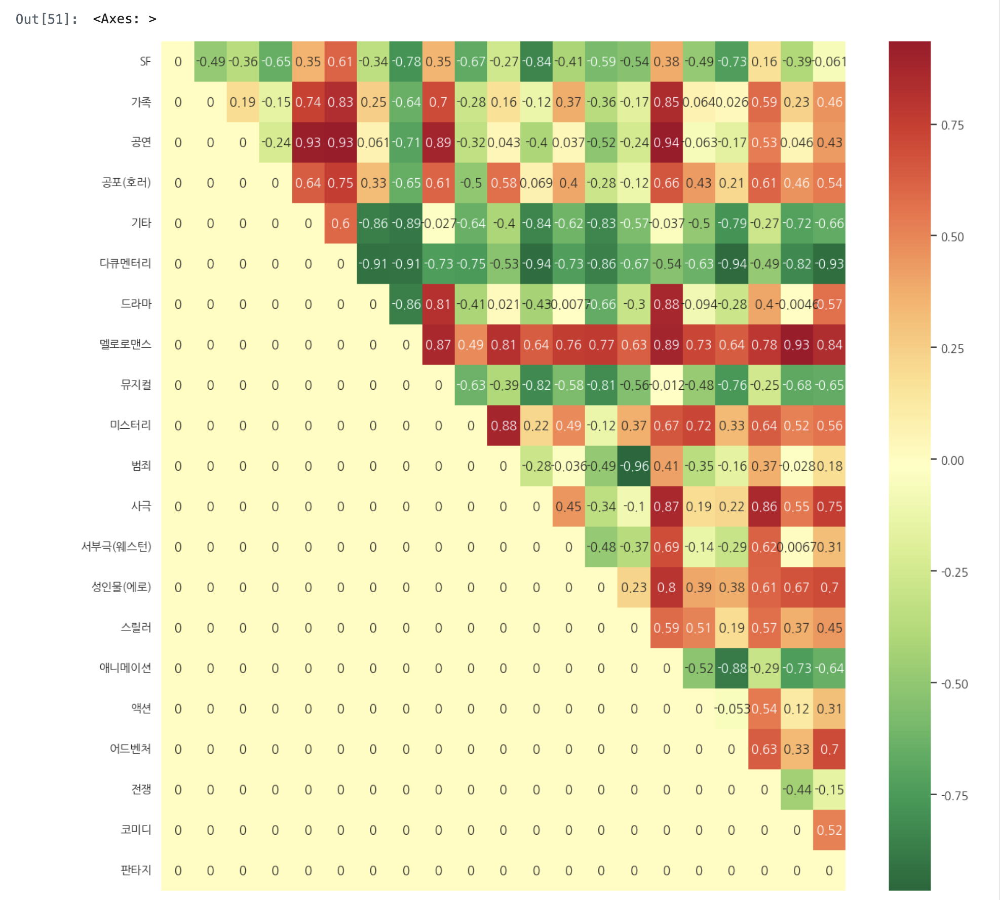
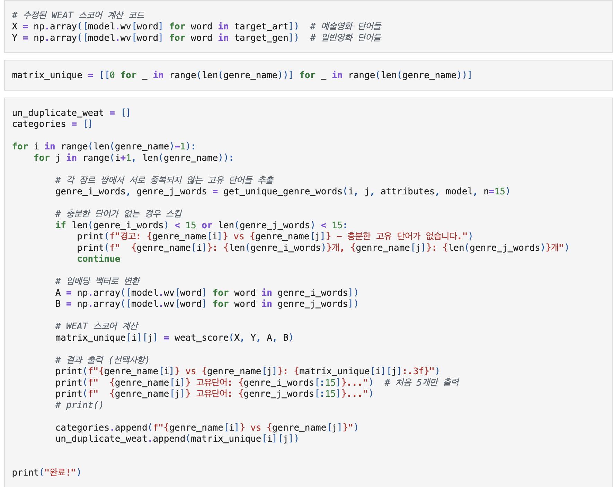
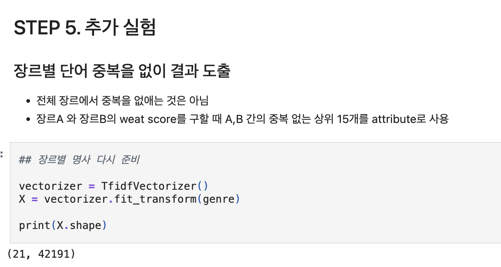
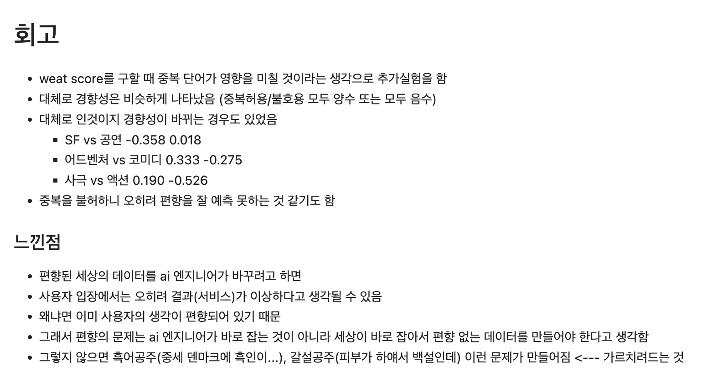

# AIFFEL Campus Online Code Peer Review Templete
- 코더 : 장수봉
- 리뷰어 : 박진용


# PRT(Peer Review Template)
- [x]  **1. 주어진 문제를 해결하는 완성된 코드가 제출되었나요?**
    - 문제에서 요구하는 최종 결과물이 첨부되었는지 확인
        
    - 
    
- [x]  **2. 전체 코드에서 가장 핵심적이거나 가장 복잡하고 이해하기 어려운 부분에 작성된 
주석 또는 doc string을 보고 해당 코드가 잘 이해되었나요?**
    -
        
- [x]  **3. 에러가 난 부분을 디버깅하여 문제를 해결한 기록을 남겼거나
새로운 시도 또는 추가 실험을 수행해봤나요?**
      
        
- [x]  **4. 회고를 잘 작성했나요?**
    
        
- [x]  **5. 코드가 간결하고 효율적인가요?**
    

# 회고(참고 링크 및 코드 개선)
```
중복단어에 대한 영향을 생각한게 흥미로웠음
데이터의 편향이 사실은 세계의 편향이라는건 어느정도 동의하는 바 이긴 함
물은 차갑고 불은 뜨거운것도 어떻게 생각하면 편향으로 칠 수 있다고 생각함
사실 편향은 존재하지 않는걸지도 모르겠다
```

