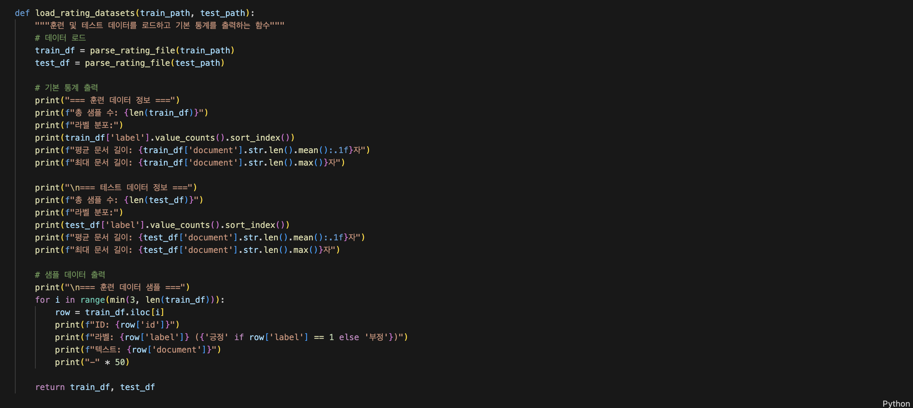
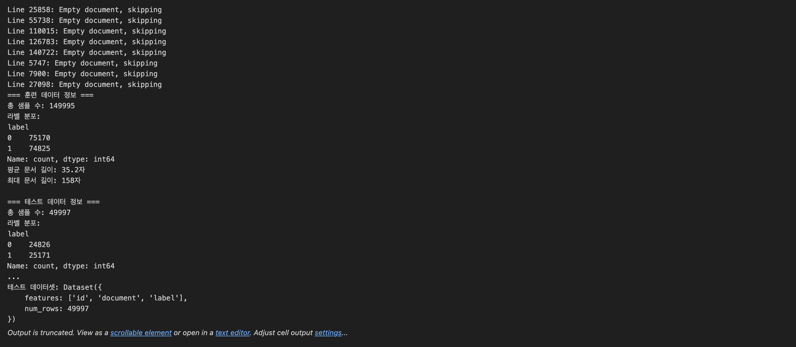
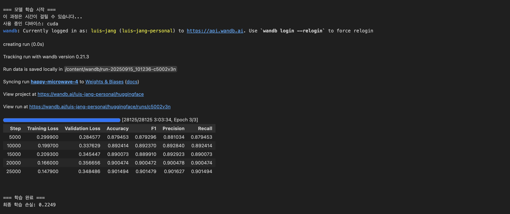
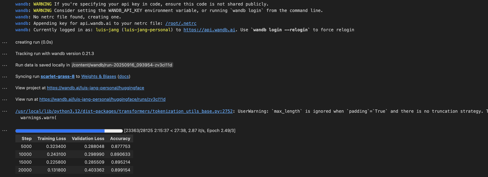
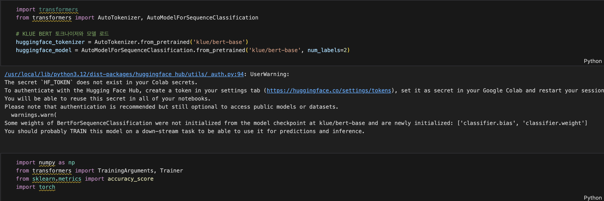
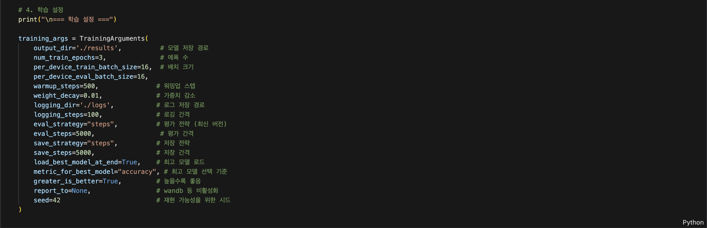
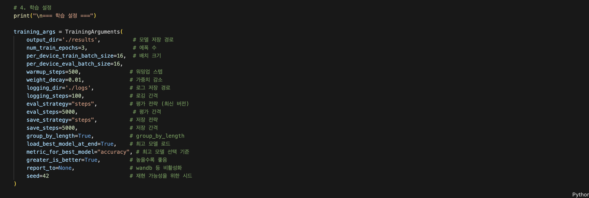
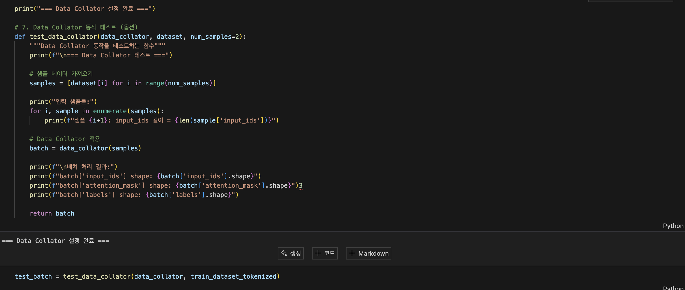
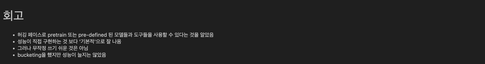

# AIFFEL Campus Online Code Peer Review Templete
- 코더 : 장수봉
- 리뷰어 : 이규철 


# PRT(Peer Review Template)
- [X]  **1. 주어진 문제를 해결하는 완성된 코드가 제출되었나요?**
    - 문제에서 요구하는 최종 결과물이 첨부되었는지 확인
        - 중요! 해당 조건을 만족하는 부분을 캡쳐해 근거로 첨부






모델과 데이터를 정상적으로 불러오고, 작동하는 것을 확인 하셨습니다.
Preprocessing을 따로 진행하시지는 않았지만, fine-tuning을 통해 모델의 성능을 개선시켰습니다.
모델 학습에 Bucketing을 성공적으로 적용하고 그 결과를 비교하셨습니다.
따로 Preprocessing을 진행하지 않으시고 train/validation/test로 나눠두지 않은 점이 아쉬웠습니다.
    
- [X]  **2. 전체 코드에서 가장 핵심적이거나 가장 복잡하고 이해하기 어려운 부분에 작성된 
주석 또는 doc string을 보고 해당 코드가 잘 이해되었나요?**
    - 해당 코드 블럭을 왜 핵심적이라고 생각하는지 확인
    - 해당 코드 블럭에 doc string/annotation이 달려 있는지 확인
    - 해당 코드의 기능, 존재 이유, 작동 원리 등을 기술했는지 확인
    - 주석을 보고 코드 이해가 잘 되었는지 확인
        - 중요! 잘 작성되었다고 생각되는 부분을 캡쳐해 근거로 첨부






다양한 하이퍼 파라미터를 사용해서 실험을 진행하셨습니다.
중요한 부분인 모델의 하이퍼 파라미터 선언 후 학습까지 다 보였습니다.
부켓팅 과정에서 그룹바이랭스만 사용한게 아니라 데이터 콜레이터도 사용하신 점 인상깊었습니다.
이 부분에서 어떤 차이가 있는지 더 학습을 해봐야겠습니다.
        
- [X]  **3. 에러가 난 부분을 디버깅하여 문제를 해결한 기록을 남겼거나
새로운 시도 또는 추가 실험을 수행해봤나요?**
    - 문제 원인 및 해결 과정을 잘 기록하였는지 확인
    - 프로젝트 평가 기준에 더해 추가적으로 수행한 나만의 시도, 
    실험이 기록되어 있는지 확인
        - 중요! 잘 작성되었다고 생각되는 부분을 캡쳐해 근거로 첨부

하이퍼 파라미터 튜닝을 충실하게 하셨습니다.
        
- [X]  **4. 회고를 잘 작성했나요?**
    - 주어진 문제를 해결하는 완성된 코드 내지 프로젝트 결과물에 대해
    배운점과 아쉬운점, 느낀점 등이 기록되어 있는지 확인
    - 전체 코드 실행 플로우를 그래프로 그려서 이해를 돕고 있는지 확인
        - 중요! 잘 작성되었다고 생각되는 부분을 캡쳐해 근거로 첨부



회고를 간결하게 작성하셨습니다.        

- [X]  **5. 코드가 간결하고 효율적인가요?**
    - 파이썬 스타일 가이드 (PEP8) 를 준수하였는지 확인
    - 코드 중복을 최소화하고 범용적으로 사용할 수 있도록 함수화/모듈화했는지 확인
        - 중요! 잘 작성되었다고 생각되는 부분을 캡쳐해 근거로 첨부

코드가 노드에 맞춰서 잘 작성되어있습니다.

# 회고(참고 링크 및 코드 개선)
```
허깅페이스를 통해 학습을 시키는 과정 자체가 너무 재밌었고 정말 간단하고 편했습니다.
상황에 따라 허깅페이스와 파이토치 프레임워크를 혼용에서 활용 할 여지가 충분히 있다고 생각했습니다.
수봉님이 시도하신 부켓팅에서 데이터 콜레이터와 그룹바이랭스를 쓰는 부분에 대한 학습을 해봐야겠다는
생각이 들었습니다. 지금 이 데이터셋 말고 공인된 벤치마크데이터셋에서 한번 부켓팅을 활용했을 때 만약
정확도의 차이가 그리 심하지 않은 상황이라면 저라면 효율성의 문제 때문에 부켓팅을 무조건 사용하지 
않을까? 싶습니다. 엄청 재밌는 노드였고 프로젝트였습니다.

# 리뷰어의 회고를 작성합니다.
# 코드 리뷰 시 참고한 링크가 있다면 링크와 간략한 설명을 첨부합니다.
# 코드 리뷰를 통해 개선한 코드가 있다면 코드와 간략한 설명을 첨부합니다.
```

